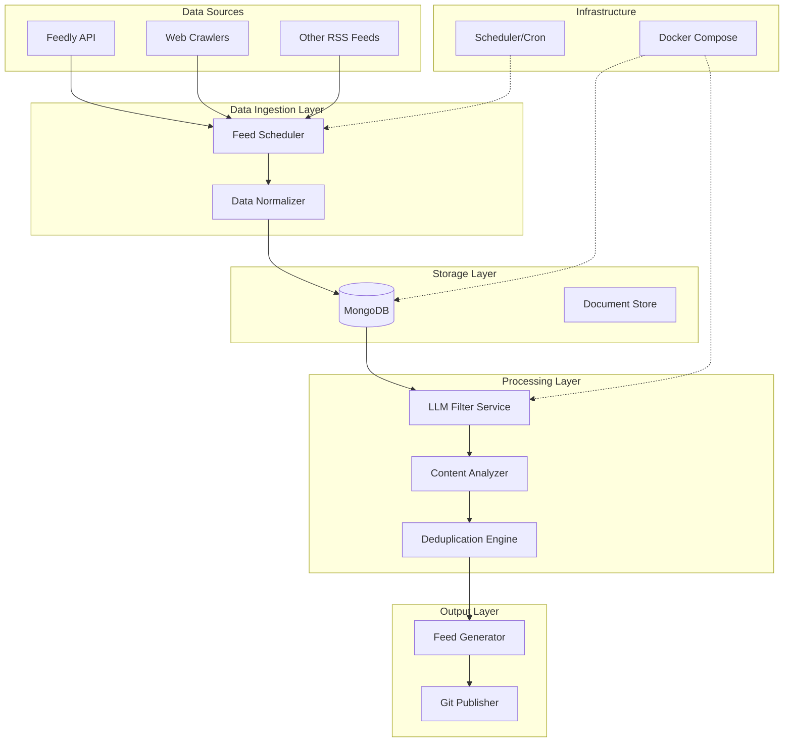

# Intelligence Feed System

An intelligent feed aggregation system that processes content from multiple sources, applies LLM-based filtering, and generates curated RSS feeds. The system uses Docker for containerization and implements comprehensive security practices.

## System Architecture



## Project Structure

```
feed/
├── docker/                          # Docker configuration
│   ├── docker-compose.yml           # Production configuration
│   ├── docker-compose.dev.yml       # Development overrides
│   ├── .env.example                 # Environment template
│   ├── secrets/                     # Docker secrets (gitignored)
│   └── mongodb_init/                # MongoDB initialization scripts
├── feed_aggregator/                 # Main application package
│   ├── config/                      # Configuration management
│   ├── etl/                         # ETL pipeline components
│   ├── ingestion/                   # Data ingestion modules
│   ├── processing/                  # Content processing (LLM, analysis)
│   ├── storage/                     # Database clients and storage
│   └── fetcher.py                   # Core fetching functionality
├── scripts/                         # Utility and runner scripts
├── tests/                          # Comprehensive test suite
├── config/                         # Application configuration files
│   ├── categories.yml              # Category definitions
│   ├── prompts.yml                 # LLM prompts
│   └── prompts/                    # Category-specific prompts
├── docs/                           # Documentation
└── output/                         # Generated feeds and artifacts
```

AlphaEvolve PDF: https://storage.googleapis.com/deepmind-media/DeepMind.com/Blog/alphaevolve-a-gemini-powered-coding-agent-for-designing-advanced-algorithms/AlphaEvolve.pdf
Blog post: https://deepmind.google/discover/blog/alphaevolve-a-gemini-powered-coding-agent-for-designing-advanced-algorithms/
Repository: https://github.com/BenjaminNowak/feed

## Feed Aggregator Setup

### Quick Setup

Run the setup script to create a virtual environment and install dependencies:

```bash
./setup_env.sh
```

### Manual Setup

1. Create and activate a virtual environment:
   ```bash
   python3 -m venv venv
   source venv/bin/activate
   ```

2. Install dependencies:
   ```bash
   pip install -r requirements.txt
   pip install -e .
   ```

### Running the Example

#### Demo Mode (No API Token Required)

```bash
source venv/bin/activate
python scripts/example_fetch.py
```

This will run in demo mode and return sample data.

#### With API Access

The setup script automatically loads credentials from Docker secrets if available.
Alternatively, set your API credentials as environment variables:

```bash
export FEEDLY_TOKEN='your_feedly_access_token'
export FEEDLY_USER='your_feedly_user_id'
export MONGODB_USERNAME='your_mongodb_username'
export MONGODB_PASSWORD='your_mongodb_password'
export OPENAI_API_KEY='your_openai_api_key'
source venv/bin/activate
python scripts/example_fetch.py
```

### Docker Deployment

For production deployment, use Docker with secrets management:

1. Set up Docker secrets in `docker/secrets/`:
   - `mongo_username.txt`
   - `mongo_password.txt`
   - `feedly_token.txt`
   - `openai_api_key.txt`
   - `github_token.txt`

2. Run with Docker Compose:
   ```bash
   cd docker
   docker-compose up -d
   ```

### Secrets Management

The project uses a robust secrets management approach:

1. **Docker Secrets (Recommended for Production)**
   - Store sensitive data in `docker/secrets/` directory:
     ```
     docker/secrets/
     ├── mongo_username.txt
     ├── mongo_password.txt
     ├── feedly_token.txt
     ├── openai_api_key.txt
     └── github_token.txt
     ```
   - These files are automatically loaded by Docker Compose
   - The `docker/secrets/` directory is gitignored

2. **Environment Variables (Development/Testing)**
   - Use environment variables for local development:
     ```bash
     export FEEDLY_TOKEN='your_feedly_access_token'
     export FEEDLY_USER='your_feedly_user_id'
     export MONGODB_USERNAME='your_mongodb_username'
     export MONGODB_PASSWORD='your_mongodb_password'
     export OPENAI_API_KEY='your_openai_api_key'
     ```
   - Never commit these values to version control

3. **Secret Detection**
   - The project uses [Gitleaks](https://github.com/gitleaks/gitleaks) in pre-commit hooks to prevent accidental commit of secrets
   - Also includes detect-private-key hook to catch any committed private keys
   - Run `pre-commit install` to enable these checks locally

### Running Tests

```bash
source venv/bin/activate
python -m pytest tests/ -v
```

## Viewing the RSS feed

Once GitHub Pages is enabled, navigate to `https://<username>.github.io/<repository>/feed.xml` (replace `<username>` and `<repository>` with your values) to see the RSS output. The site includes a basic `index.html` page that links to the feed.

## Enabling GitHub Pages

1. Open the repository on GitHub and go to **Settings**.
2. Select **Pages** from the left sidebar.
3. Under **Build and deployment**, choose the branch (e.g., `main`) and the folder (usually `/root` or `/docs`).
4. Click **Save**. GitHub will provide a link to your published site in a few moments.
