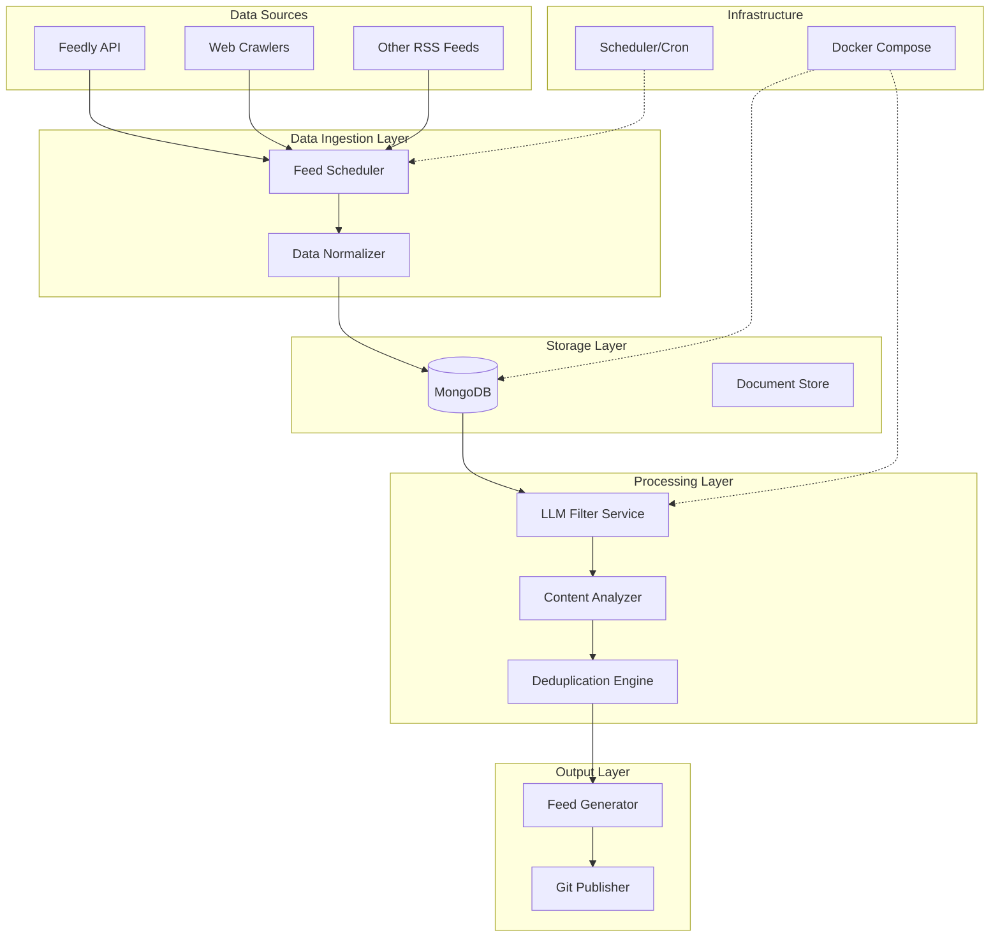

# Intelligence Feed System Architecture

## System Overview

The Intelligence Feed System is a scalable, containerized application that aggregates content from multiple sources, processes it through LLM filtering, and publishes high-signal content to a curated feed.



## Project Structure

```
feed-aggregator/
├── docker/
│   ├── docker-compose.yml           # Base configuration
│   ├── docker-compose.dev.yml       # Development overrides
│   ├── docker-compose.prod.yml      # Production overrides
│   └── .env.example                 # Environment template
├── feed_aggregator/
│   ├── ingestion/
│   │   ├── __init__.py
│   │   ├── feedly_ingester.py
│   │   ├── web_crawler.py
│   │   └── data_normalizer.py
│   ├── storage/
│   │   ├── __init__.py
│   │   ├── mongodb_client.py
│   │   └── document_store.py
│   ├── processing/
│   │   ├── __init__.py
│   │   ├── llm_filter.py
│   │   └── content_analyzer.py
│   └── output/
│       ├── __init__.py
│       ├── feed_generator.py
│       └── git_publisher.py
├── scripts/
│   ├── setup_secrets.sh             # Secret management
│   └── deploy.sh                    # Deployment helper
├── tests/
│   └── ...                         # Test files
├── config/
│   ├── prompts.yml                 # LLM prompts
│   └── feeds.yml                   # Feed configurations
├── .gitignore
└── README.md
```

## Docker Configuration

### Base Configuration (docker/docker-compose.yml)

```yaml
version: '3.8'
services:
  mongodb:
    image: mongo:7
    container_name: feed_mongo
    restart: unless-stopped
    secrets:
      - mongo_username
      - mongo_password
    environment:
      MONGO_INITDB_ROOT_USERNAME_FILE: /run/secrets/mongo_username
      MONGO_INITDB_ROOT_PASSWORD_FILE: /run/secrets/mongo_password
    volumes:
      - mongodb_data:/data/db
    networks:
      - feed_network

  feed_processor:
    build:
      context: ..
      dockerfile: docker/Dockerfile
    container_name: feed_processor
    restart: unless-stopped
    depends_on:
      - mongodb
    secrets:
      - feedly_token
      - openai_api_key
      - github_token
    environment:
      - MONGODB_HOST=mongodb
      - MONGODB_PORT=27017
      - MONGODB_USERNAME_FILE=/run/secrets/mongo_username
      - MONGODB_PASSWORD_FILE=/run/secrets/mongo_password
      - FEEDLY_TOKEN_FILE=/run/secrets/feedly_token
      - OPENAI_API_KEY_FILE=/run/secrets/openai_api_key
      - GITHUB_TOKEN_FILE=/run/secrets/github_token
    volumes:
      - ../config:/app/config:ro
      - ../output:/app/output
    networks:
      - feed_network

networks:
  feed_network:
    driver: bridge

volumes:
  mongodb_data:

secrets:
  mongo_username:
    file: ./secrets/mongo_username.txt
  mongo_password:
    file: ./secrets/mongo_password.txt
  feedly_token:
    file: ./secrets/feedly_token.txt
  openai_api_key:
    file: ./secrets/openai_api_key.txt
  github_token:
    file: ./secrets/github_token.txt
```

### Development Configuration (docker/docker-compose.dev.yml)

```yaml
version: '3.8'
services:
  mongodb:
    ports:
      - "27017:27017"  # Expose MongoDB port for development

  feed_processor:
    build:
      target: development
    volumes:
      - ..:/app:rw  # Mount entire project for development
    environment:
      - DEBUG=1
      - PYTHONUNBUFFERED=1
    ports:
      - "5000:5000"  # API port for development
```

### Production Configuration (docker/docker-compose.prod.yml)

```yaml
version: '3.8'
services:
  mongodb:
    logging:
      driver: "json-file"
      options:
        max-size: "10m"
        max-file: "3"

  feed_processor:
    build:
      target: production
    deploy:
      replicas: 2
      restart_policy:
        condition: on-failure
        max_attempts: 3
    logging:
      driver: "json-file"
      options:
        max-size: "10m"
        max-file: "3"
```

## Data Model

### MongoDB Document Schema

```json
{
  "_id": "unique_content_hash",
  "source": "feedly|webcrawl|rss",
  "source_id": "original_item_id",
  "title": "Article Title",
  "content": "Full content or summary",
  "url": "original_url",
  "author": "author_name",
  "published_date": "ISO_timestamp",
  "ingested_date": "ISO_timestamp",
  "tags": ["tag1", "tag2"],
  "metadata": {
    "source_feed": "feed_name",
    "language": "en",
    "word_count": 500
  },
  "processing_status": "pending|processed|filtered_out|published",
  "llm_analysis": {
    "relevance_score": 0.85,
    "summary": "LLM generated summary",
    "key_topics": ["AI", "Machine Learning"],
    "filtered_reason": null
  }
}
```

## Processing Pipeline

1. **Data Ingestion (Every 30 minutes)**
   - Fetch from configured sources
   - Normalize data format
   - Store in MongoDB

2. **Content Processing (Every hour)**
   - Process unfiltered items
   - Apply LLM filtering
   - Update processing status

3. **Feed Generation (Every 2 hours)**
   - Generate RSS feed from filtered items
   - Update feed.yml
   - Commit and push to git

## Security Considerations

1. **Secret Management**
   - Secrets stored securely using Docker secrets
   - No sensitive data in git repository
   - Restricted file permissions
   - Pre-commit hooks for secret detection:
     - Gitleaks for comprehensive secret scanning
     - Custom pattern-based secret detection
     - Multiple security hooks for different secret types
     - Automatic blocking of commits containing secrets

2. **Network Security**
   - Internal Docker network for service communication
   - Minimal port exposure
   - TLS for external communications

3. **Access Control**
   - Principle of least privilege
   - Service-specific credentials
   - Regular credential rotation

4. **Git Security**
   - Pre-commit hooks prevent accidental secret exposure
   - Custom secret scanner with extensive pattern matching
   - Automated scanning of staged files
   - Clear warning messages and remediation steps
   - Patterns for common API keys, tokens, and credentials
   - Skip rules for appropriate directories (docker/secrets/, .git/, venv/)

## Pre-commit Hook Setup

The repository includes pre-commit hooks for security:

```bash
# Install pre-commit
pip install pre-commit

# Install the pre-commit hooks
pre-commit install

# Run against all files (optional)
pre-commit run --all-files
```

The pre-commit configuration (.pre-commit-config.yaml) includes:
1. Gitleaks for comprehensive secret scanning
2. Standard pre-commit hooks for common secrets
3. Custom secret scanner (scripts/scan_secrets.sh) for project-specific patterns

The custom secret scanner checks for:
- API keys and tokens
- Database connection strings
- AWS credentials
- Private keys and certificates
- Environment variables containing secrets
- Custom patterns specific to the project

When a potential secret is detected:
1. The commit is blocked
2. A warning message shows the file and matched pattern
3. Suggestions for proper secret management are displayed

## Deployment

### Local Development

```bash
# Setup secrets
./scripts/setup_secrets.sh

# Start development environment
docker-compose -f docker/docker-compose.yml -f docker/docker-compose.dev.yml up -d
```

### Production Deployment

```bash
# Setup secrets
./scripts/setup_secrets.sh

# Start production environment
docker-compose -f docker/docker-compose.yml -f docker/docker-compose.prod.yml up -d
```

## Monitoring & Logging

- Structured JSON logging
- Container logs retained with rotation
- MongoDB metrics monitoring
- Application health checks
- Processing pipeline metrics

## Scaling Considerations

1. **Horizontal Scaling**
   - Multiple feed processor instances
   - MongoDB replication
   - Load balancing

2. **Performance Optimization**
   - Caching layer for frequently accessed content
   - Batch processing for LLM operations
   - Efficient database indexing

## Future Enhancements

1. **Additional Features**
   - Content categorization
   - User preferences
   - API endpoints for feed customization

2. **Infrastructure**
   - Kubernetes deployment
   - Cloud provider integration
   - Advanced monitoring
